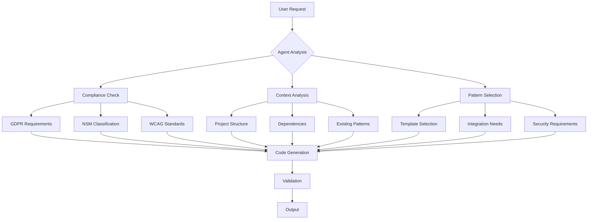

# Xaheen Platform - Agent Usage Guide

## Table of Contents

1. [Introduction for AI Agents](#introduction-for-ai-agents)
2. [Understanding the Xaheen Platform](#understanding-the-xaheen-platform)
3. [Agent Decision Trees](#agent-decision-trees)
4. [Common Agent Tasks](#common-agent-tasks)
5. [Code Generation Patterns](#code-generation-patterns)
6. [Compliance Awareness](#compliance-awareness)
7. [Integration Patterns](#integration-patterns)
8. [Error Handling](#error-handling)
9. [Best Practices for Agents](#best-practices-for-agents)
10. [Agent Examples](#agent-examples)

## Introduction for AI Agents

This guide is specifically designed for AI agents working with the Xaheen platform. It provides structured information, decision trees, and patterns to help you generate high-quality, compliant code efficiently.

### Key Principles for Agents

```typescript
interface AgentPrinciples {
  alwaysCheck: {
    compliance: ['GDPR', 'NSM', 'WCAG'];
    typescript: 'strict-mode';
    patterns: 'enterprise-grade';
    security: 'defense-in-depth';
  };
  
  neverAssume: {
    defaults: 'Always ask for specifics';
    libraries: 'Check package.json first';
    permissions: 'Verify user authorization';
    context: 'Understand project structure';
  };
  
  prioritize: {
    1: 'Security and compliance';
    2: 'Type safety';
    3: 'Performance';
    4: 'User experience';
    5: 'Maintainability';
  };
}
```

## Understanding the Xaheen Platform

### Platform Architecture for Agents



### Core Concepts for Agents

```typescript
// 1. Multi-Mode CLI
type CLIMode = 'legacy' | 'token' | 'xala' | 'xaheen';

// 2. Compliance Levels
type ComplianceLevel = {
  gdpr: boolean;
  nsm: 'OPEN' | 'INTERNAL' | 'RESTRICTED' | 'CONFIDENTIAL';
  wcag: 'A' | 'AA' | 'AAA';
};

// 3. Template Types
type TemplateType = {
  component: 'ui' | 'page' | 'layout' | 'composite';
  api: 'rest' | 'graphql' | 'trpc' | 'websocket';
  integration: 'vipps' | 'bankid' | 'altinn' | 'stripe';
  database: 'prisma' | 'drizzle' | 'mongodb';
};

// 4. Security Requirements
type SecurityLevel = {
  authentication: 'public' | 'basic' | 'mfa' | 'bankid';
  encryption: 'none' | 'transit' | 'rest' | 'field-level';
  audit: 'none' | 'basic' | 'comprehensive' | 'real-time';
};
```

## Agent Decision Trees

### Task Classification Decision Tree

```typescript
function classifyUserRequest(request: string): TaskClassification {
  // Level 1: Identify primary action
  if (contains(request, ['create', 'generate', 'scaffold', 'init'])) {
    return classifyGenerationTask(request);
  }
  
  if (contains(request, ['update', 'modify', 'change', 'fix'])) {
    return classifyModificationTask(request);
  }
  
  if (contains(request, ['integrate', 'connect', 'add'])) {
    return classifyIntegrationTask(request);
  }
  
  if (contains(request, ['validate', 'check', 'test', 'verify'])) {
    return classifyValidationTask(request);
  }
  
  return { type: 'unknown', needsClarification: true };
}

function classifyGenerationTask(request: string): GenerationTask {
  // Level 2: Identify what to generate
  const patterns = {
    component: /component|button|form|card|modal/i,
    page: /page|route|view|screen/i,
    api: /api|endpoint|service|backend/i,
    model: /model|schema|database|entity/i,
    integration: /vipps|bankid|stripe|payment/i,
  };
  
  for (const [type, pattern] of Object.entries(patterns)) {
    if (pattern.test(request)) {
      return {
        type: 'generation',
        subtype: type,
        compliance: extractComplianceNeeds(request),
        security: extractSecurityNeeds(request),
      };
    }
  }
}
```

### Compliance Decision Tree

```typescript
function determineComplianceRequirements(
  task: Task,
  context: ProjectContext
): ComplianceRequirements {
  const requirements: ComplianceRequirements = {
    gdpr: false,
    nsm: 'OPEN',
    wcag: 'AA',
  };
  
  // GDPR Detection
  if (hasPersonalData(task) || context.region === 'EU') {
    requirements.gdpr = true;
  }
  
  // NSM Classification
  if (hasFinancialData(task)) {
    requirements.nsm = 'RESTRICTED';
  }
  if (hasPersonalIdentifiers(task)) {
    requirements.nsm = 'CONFIDENTIAL';
  }
  
  // WCAG Level
  if (context.sector === 'government') {
    requirements.wcag = 'AAA';
  }
  
  return requirements;
}
```

## Common Agent Tasks

### 1. Component Generation

```typescript
// Agent Pattern: Component Generation
async function generateComponent(spec: ComponentSpec): Promise<GeneratedCode> {
  // Step 1: Analyze requirements
  const analysis = {
    hasProps: spec.props && spec.props.length > 0,
    needsState: detectStateNeeds(spec),
    needsEffects: detectEffectNeeds(spec),
    compliance: determineCompliance(spec),
  };
  
  // Step 2: Select template
  const template = selectComponentTemplate({
    type: spec.type,
    complexity: analysis,
    compliance: analysis.compliance,
  });
  
  // Step 3: Generate code
  const code = await renderTemplate(template, {
    name: spec.name,
    props: spec.props,
    hooks: analysis.needsState ? generateHooks(spec) : [],
    accessibility: generateA11yAttributes(spec),
    styling: generateTailwindClasses(spec),
  });
  
  // Step 4: Validate
  await validateComponent(code, analysis.compliance);
  
  return code;
}
```

### 2. API Endpoint Generation

```typescript
// Agent Pattern: API Generation
async function generateAPI(spec: APISpec): Promise<GeneratedAPI> {
  // Determine security requirements
  const security = {
    authentication: spec.auth || 'jwt',
    authorization: spec.roles || ['user'],
    encryption: spec.sensitive ? 'required' : 'optional',
    rateLimit: spec.rateLimit || '100/hour',
  };
  
  // Generate endpoint code
  const endpoint = {
    method: spec.method,
    path: spec.path,
    handler: generateHandler(spec),
    middleware: [
      security.authentication !== 'none' && 'authenticate',
      security.authorization.length > 0 && 'authorize',
      spec.validation && 'validate',
      spec.audit && 'auditLog',
    ].filter(Boolean),
  };
  
  // Add compliance features
  if (spec.compliance?.gdpr) {
    endpoint.middleware.push('gdprConsent');
    endpoint.handler = wrapWithGDPR(endpoint.handler);
  }
  
  return endpoint;
}
```

### 3. Database Model Generation

```typescript
// Agent Pattern: Model Generation
async function generateModel(spec: ModelSpec): Promise<PrismaModel> {
  const model = {
    name: spec.name,
    fields: [],
    attributes: [],
  };
  
  // Process fields with compliance
  for (const field of spec.fields) {
    const processedField = {
      name: field.name,
      type: field.type,
      attributes: [],
    };
    
    // Add encryption for sensitive fields
    if (isSensitiveField(field)) {
      processedField.attributes.push('@encrypted');
      
      // NSM classification
      if (field.name === 'personalNumber') {
        processedField.attributes.push('@nsm_confidential');
      }
    }
    
    // GDPR annotations
    if (isPersonalData(field)) {
      processedField.attributes.push('@gdpr_personal');
    }
    
    model.fields.push(processedField);
  }
  
  // Add audit fields
  model.fields.push(
    { name: 'createdAt', type: 'DateTime', attributes: ['@default(now())'] },
    { name: 'updatedAt', type: 'DateTime', attributes: ['@updatedAt'] }
  );
  
  // Add model-level attributes
  if (spec.audit) {
    model.attributes.push('@@audit_log');
  }
  
  return model;
}
```

## Code Generation Patterns

### Pattern: Compliant Component

```typescript
// Template for generating compliant React components
const compliantComponentTemplate = `
import React{{ hooks }} from 'react';
{{ imports }}

{{ interfaceDefinition }}

export const {{ componentName }} = ({{ props }}): JSX.Element => {
  {{ stateDeclarations }}
  {{ effectDeclarations }}
  
  {{ eventHandlers }}
  
  return (
    <{{ containerElement }}
      {{ accessibility }}
      {{ styling }}
      {{ dataCompliance }}
    >
      {{ children }}
    </{{ containerElement }}>
  );
};

{{ displayName }}
{{ propTypes }}
`;

// Pattern application
function applyComponentPattern(spec: ComponentSpec): string {
  return compliantComponentTemplate
    .replace('{{ hooks }}', spec.hooks ? `, { ${spec.hooks.join(', ')} }` : '')
    .replace('{{ imports }}', generateImports(spec))
    .replace('{{ interfaceDefinition }}', generateInterface(spec))
    .replace('{{ componentName }}', spec.name)
    .replace('{{ props }}', generatePropsSignature(spec))
    .replace('{{ accessibility }}', generateA11yProps(spec))
    .replace('{{ styling }}', generateStyling(spec))
    .replace('{{ dataCompliance }}', generateDataCompliance(spec));
}
```

### Pattern: Secure API Route

```typescript
// Template for secure API routes
const secureAPITemplate = `
import { withAuth } from '@/middleware/auth';
import { withAudit } from '@/middleware/audit';
import { validate } from '@/middleware/validation';
import { rateLimit } from '@/middleware/rateLimit';
{{ imports }}

{{ schemas }}

export {{ method }} = withAuth(
  withAudit(
    rateLimit({{ rateLimitConfig }})(
      validate({{ validationSchema }})(
        async (req: Request, res: Response) => {
          try {
            {{ securityChecks }}
            {{ businessLogic }}
            {{ complianceActions }}
            
            return res.json({
              success: true,
              data: {{ responseData }},
            });
          } catch (error) {
            {{ errorHandling }}
          }
        }
      )
    )
  )
);
`;
```

## Compliance Awareness

### GDPR Compliance Checklist for Agents

```typescript
interface GDPRChecklist {
  personalData: {
    check: 'Does the component handle personal data?';
    action: 'Add encryption and consent management';
  };
  
  dataCollection: {
    check: 'Is data being collected from users?';
    action: 'Implement purpose limitation and data minimization';
  };
  
  userRights: {
    check: 'Can users access/modify/delete their data?';
    action: 'Implement GDPR rights (access, rectification, erasure)';
  };
  
  consent: {
    check: 'Is explicit consent needed?';
    action: 'Add consent UI and tracking';
  };
  
  auditTrail: {
    check: 'Are data operations being logged?';
    action: 'Implement comprehensive audit logging';
  };
}

// Agent helper function
function checkGDPRCompliance(code: string): ComplianceReport {
  const issues = [];
  
  if (code.includes('email') && !code.includes('encrypted')) {
    issues.push({
      type: 'GDPR',
      severity: 'HIGH',
      message: 'Email field should be encrypted',
      fix: 'Add @encrypted attribute',
    });
  }
  
  if (code.includes('personalNumber') && !code.includes('consent')) {
    issues.push({
      type: 'GDPR',
      severity: 'CRITICAL',
      message: 'Personal number requires explicit consent',
      fix: 'Add consent check before processing',
    });
  }
  
  return { issues, compliant: issues.length === 0 };
}
```

### NSM Security Classification for Agents

```typescript
// Agent helper: Classify data automatically
function classifyDataForNSM(data: any): NSMClassification {
  const classificationRules = [
    {
      pattern: /\d{11}/, // Norwegian personal number
      classification: 'CONFIDENTIAL',
    },
    {
      pattern: /kontonummer|account.*number/i,
      classification: 'RESTRICTED',
    },
    {
      pattern: /internal|employee|staff/i,
      classification: 'INTERNAL',
    },
  ];
  
  const content = JSON.stringify(data);
  
  for (const rule of classificationRules) {
    if (rule.pattern.test(content)) {
      return rule.classification;
    }
  }
  
  return 'OPEN';
}
```

### WCAG Accessibility for Agents

```typescript
// Agent helper: Generate accessible markup
function generateAccessibleComponent(spec: ComponentSpec): AccessibleMarkup {
  const a11y = {
    attributes: [],
    ariaLabels: [],
    semanticHTML: true,
  };
  
  // Interactive elements need labels
  if (spec.interactive) {
    a11y.attributes.push(`aria-label="${spec.label || spec.name}"`);
  }
  
  // Form elements need proper association
  if (spec.type === 'input') {
    const id = `${spec.name}-${generateId()}`;
    a11y.attributes.push(`id="${id}"`);
    a11y.attributes.push(`aria-describedby="${id}-error"`);
    a11y.attributes.push(`aria-required="${spec.required}"`);
  }
  
  // Ensure color contrast
  if (spec.styling?.color) {
    const contrast = calculateContrast(spec.styling.color, spec.styling.background);
    if (contrast < 7) {
      console.warn('Insufficient color contrast for WCAG AAA');
    }
  }
  
  return a11y;
}
```

## Integration Patterns

### Norwegian Service Integrations

```typescript
// Agent Pattern: BankID Integration
async function integrateBankID(config: BankIDConfig): Promise<Integration> {
  return {
    setup: `
      // 1. Install dependencies
      npm install @bankid/client
      
      // 2. Configure environment
      BANKID_ENV=${config.environment} // 'test' or 'prod'
      BANKID_CERT_PATH=${config.certPath}
      BANKID_CERT_PASSPHRASE=${config.passphrase}
    `,
    
    implementation: `
      import { BankIDClient } from '@bankid/client';
      
      const client = new BankIDClient({
        environment: process.env.BANKID_ENV,
        certificate: {
          path: process.env.BANKID_CERT_PATH,
          passphrase: process.env.BANKID_CERT_PASSPHRASE,
        },
      });
      
      export async function authenticateWithBankID(personalNumber: string) {
        // Start authentication
        const { orderRef } = await client.auth({
          personalNumber,
          endUserIp: getClientIP(),
        });
        
        // Poll for result
        return pollBankIDStatus(orderRef);
      }
    `,
    
    compliance: {
      gdpr: 'Requires explicit consent for personal number',
      nsm: 'Classify as CONFIDENTIAL',
      audit: 'Log all authentication attempts',
    },
  };
}

// Agent Pattern: Vipps Integration
async function integrateVipps(config: VippsConfig): Promise<Integration> {
  return {
    setup: `
      // Environment variables
      VIPPS_CLIENT_ID=${config.clientId}
      VIPPS_CLIENT_SECRET=${config.clientSecret}
      VIPPS_SUBSCRIPTION_KEY=${config.subscriptionKey}
      VIPPS_MSN=${config.merchantSerialNumber}
    `,
    
    implementation: `
      import { VippsClient } from '@/lib/vipps';
      
      const vipps = new VippsClient({
        clientId: process.env.VIPPS_CLIENT_ID,
        clientSecret: process.env.VIPPS_CLIENT_SECRET,
        subscriptionKey: process.env.VIPPS_SUBSCRIPTION_KEY,
        msn: process.env.VIPPS_MSN,
        environment: process.env.NODE_ENV === 'production' ? 'prod' : 'test',
      });
      
      export async function createPayment(amount: number, orderId: string) {
        return vipps.createPayment({
          amount: amount * 100, // Convert to øre
          orderId,
          description: \`Order \${orderId}\`,
          callbackUrl: \`\${process.env.BASE_URL}/api/vipps/callback\`,
        });
      }
    `,
  };
}
```

## Error Handling

### Agent Error Handling Patterns

```typescript
// Pattern: Comprehensive error handling
function generateErrorHandling(context: ErrorContext): ErrorHandler {
  return `
    try {
      ${context.mainLogic}
    } catch (error) {
      // Log error with context
      logger.error('${context.operation} failed', {
        error: error instanceof Error ? error.message : 'Unknown error',
        stack: error instanceof Error ? error.stack : undefined,
        context: {
          userId: ${context.userId},
          operation: '${context.operation}',
          timestamp: new Date().toISOString(),
        },
      });
      
      // Audit log for compliance
      await auditLog({
        action: '${context.operation}_ERROR',
        error: sanitizeError(error),
        userId: ${context.userId},
      });
      
      // User-friendly error response
      ${generateUserResponse(context)}
      
      // Alert if critical
      ${context.critical ? 'await alertOps(error);' : ''}
    }
  `;
}

// Pattern: Validation error handling
function generateValidationErrorHandling(): string {
  return `
    const validationResult = schema.safeParse(data);
    
    if (!validationResult.success) {
      const errors = validationResult.error.flatten();
      
      return {
        success: false,
        errors: errors.fieldErrors,
        message: 'Validation failed',
        details: process.env.NODE_ENV === 'development' ? errors : undefined,
      };
    }
  `;
}
```

## Best Practices for Agents

### 1. Always Check Context

```typescript
// Before generating code, analyze the project
async function analyzeProjectContext(): Promise<ProjectContext> {
  const context = {
    // Check package.json for dependencies
    dependencies: await readPackageJson(),
    
    // Check for existing patterns
    patterns: await analyzeCodePatterns(),
    
    // Check compliance requirements
    compliance: await detectComplianceNeeds(),
    
    // Check tech stack
    stack: await identifyTechStack(),
  };
  
  return context;
}
```

### 2. Use Existing Patterns

```typescript
// Look for existing patterns before creating new ones
async function findExistingPatterns(type: string): Promise<Pattern[]> {
  const patterns = await searchCodebase({
    type,
    locations: ['components', 'lib', 'utils'],
  });
  
  return patterns.map(p => ({
    name: p.name,
    usage: analyzeUsage(p),
    compliance: checkCompliance(p),
  }));
}
```

### 3. Validate Before Output

```typescript
// Always validate generated code
async function validateGeneratedCode(code: string, spec: Spec): Promise<ValidationResult> {
  const checks = [
    validateTypeScript(code),
    validateCompliance(code, spec.compliance),
    validateAccessibility(code),
    validateSecurity(code),
    validatePerformance(code),
  ];
  
  const results = await Promise.all(checks);
  
  return {
    valid: results.every(r => r.valid),
    issues: results.flatMap(r => r.issues),
    suggestions: generateSuggestions(results),
  };
}
```

## Agent Examples

### Example 1: Generate Compliant User Form

```typescript
// User request: "Create a user registration form with GDPR compliance"

// Agent process:
async function handleUserRegistrationForm(): Promise<GeneratedCode> {
  // 1. Identify requirements
  const requirements = {
    fields: ['name', 'email', 'password', 'consent'],
    compliance: { gdpr: true, wcag: 'AA' },
    validation: true,
    encryption: ['password'],
  };
  
  // 2. Generate form component
  const formCode = `
    import React, { useState } from 'react';
    import { useForm } from 'react-hook-form';
    import { zodResolver } from '@hookform/resolvers/zod';
    import { z } from 'zod';
    import { ConsentCheckbox } from '@/components/gdpr/ConsentCheckbox';
    
    const schema = z.object({
      name: z.string().min(2, 'Name must be at least 2 characters'),
      email: z.string().email('Invalid email address'),
      password: z.string().min(8, 'Password must be at least 8 characters'),
      consent: z.boolean().refine(val => val === true, 'You must accept the terms'),
    });
    
    export const UserRegistrationForm = (): JSX.Element => {
      const [isSubmitting, setIsSubmitting] = useState(false);
      
      const { register, handleSubmit, formState: { errors } } = useForm({
        resolver: zodResolver(schema),
      });
      
      const onSubmit = async (data: z.infer<typeof schema>) => {
        setIsSubmitting(true);
        
        try {
          // Log consent for GDPR
          await logConsent({
            email: data.email,
            consentType: 'registration',
            timestamp: new Date(),
          });
          
          // Submit registration
          await api.register({
            ...data,
            password: await hashPassword(data.password),
          });
        } finally {
          setIsSubmitting(false);
        }
      };
      
      return (
        <form onSubmit={handleSubmit(onSubmit)} className="space-y-6">
          <div>
            <label htmlFor="name" className="block text-sm font-medium">
              Name
            </label>
            <input
              id="name"
              {...register('name')}
              aria-invalid={!!errors.name}
              className="mt-1 block w-full rounded-lg border-gray-300"
            />
            {errors.name && (
              <p role="alert" className="mt-1 text-sm text-red-600">
                {errors.name.message}
              </p>
            )}
          </div>
          
          <ConsentCheckbox
            {...register('consent')}
            error={errors.consent}
          />
          
          <button
            type="submit"
            disabled={isSubmitting}
            className="w-full py-3 px-4 bg-blue-600 text-white rounded-lg"
          >
            {isSubmitting ? 'Registering...' : 'Register'}
          </button>
        </form>
      );
    };
  `;
  
  // 3. Generate API endpoint
  const apiCode = await generateRegistrationAPI(requirements);
  
  // 4. Generate tests
  const testCode = await generateTests(formCode, requirements);
  
  return { formCode, apiCode, testCode };
}
```

### Example 2: Generate Secure API with NSM

```typescript
// User request: "Create API for handling financial transactions with NSM security"

// Agent process:
async function handleFinancialAPI(): Promise<GeneratedCode> {
  // 1. Classify security level
  const classification = 'RESTRICTED'; // Financial data
  
  // 2. Generate secure API
  const apiCode = `
    import { withAuth } from '@/middleware/auth';
    import { withEncryption } from '@/middleware/encryption';
    import { withAudit } from '@/middleware/audit';
    import { classifyData } from '@/lib/nsm';
    
    export const POST = withAuth(
      withEncryption('RESTRICTED')(
        withAudit('financial_transaction')(
          async (req: Request) => {
            const data = await req.json();
            
            // Validate transaction
            const validation = await validateTransaction(data);
            if (!validation.valid) {
              return Response.json({ error: validation.error }, { status: 400 });
            }
            
            // Classify and encrypt sensitive data
            const classification = classifyData(data);
            const encrypted = await encryptData(data, classification);
            
            // Process transaction
            const result = await processTransaction(encrypted);
            
            // Audit log
            await auditLog({
              action: 'FINANCIAL_TRANSACTION',
              classification,
              amount: data.amount,
              currency: data.currency,
              timestamp: new Date(),
            });
            
            return Response.json({ 
              success: true,
              transactionId: result.id,
            });
          }
        )
      )
    );
  `;
  
  return { apiCode, classification };
}
```

### Example 3: Generate Accessible Dashboard

```typescript
// User request: "Create accessible dashboard page with WCAG AAA compliance"

// Agent process:
async function handleAccessibleDashboard(): Promise<GeneratedCode> {
  const dashboardCode = `
    import React, { useEffect, useRef } from 'react';
    import { useAccessibility } from '@/hooks/useAccessibility';
    
    export const Dashboard = (): JSX.Element => {
      const { announce, prefersReducedMotion } = useAccessibility('Dashboard');
      const mainRef = useRef<HTMLElement>(null);
      
      useEffect(() => {
        // Announce page change to screen readers
        announce('Dashboard loaded');
        
        // Focus management
        mainRef.current?.focus();
      }, [announce]);
      
      return (
        <>
          <a href="#main" className="sr-only focus:not-sr-only">
            Skip to main content
          </a>
          
          <div className="min-h-screen bg-gray-50">
            <header role="banner" className="bg-white shadow">
              <nav role="navigation" aria-label="Main navigation">
                {/* Navigation with proper ARIA */}
              </nav>
            </header>
            
            <main
              ref={mainRef}
              id="main"
              role="main"
              tabIndex={-1}
              className="max-w-7xl mx-auto px-4 py-8"
            >
              <h1 className="text-3xl font-bold text-gray-900">
                Dashboard
              </h1>
              
              <div
                role="region"
                aria-label="Dashboard statistics"
                className="mt-8 grid grid-cols-1 md:grid-cols-3 gap-6"
              >
                {/* Accessible cards with proper contrast */}
              </div>
              
              <section
                aria-labelledby="recent-activity"
                className="mt-8"
              >
                <h2 id="recent-activity" className="text-2xl font-semibold">
                  Recent Activity
                </h2>
                {/* Activity list with live region for updates */}
              </section>
            </main>
          </div>
        </>
      );
    };
  `;
  
  return { dashboardCode, wcagLevel: 'AAA' };
}
```

## Agent Response Templates

### Success Response Template

```typescript
const agentSuccessResponse = {
  status: 'success',
  generated: {
    files: ['path/to/component.tsx', 'path/to/api.ts'],
    commands: ['npm install required-deps', 'npm run validate'],
  },
  compliance: {
    gdpr: 'Compliant - includes consent management',
    nsm: 'INTERNAL - appropriate for business data',
    wcag: 'AAA - fully accessible',
  },
  nextSteps: [
    'Run tests with: npm test',
    'Validate compliance with: xaheen validate --all',
    'Deploy with: xaheen deploy',
  ],
};
```

### Error Response Template

```typescript
const agentErrorResponse = {
  status: 'error',
  message: 'Unable to generate code due to missing requirements',
  missingInfo: [
    'Authentication method not specified',
    'Data classification needed for NSM compliance',
    'Target WCAG level not defined',
  ],
  suggestions: [
    'Specify auth method: --auth bankid|jwt|basic',
    'Specify data classification: --nsm-level INTERNAL|RESTRICTED',
    'Specify accessibility: --wcag AA|AAA',
  ],
};
```

---

> **For Agents**: This guide provides comprehensive patterns and decision trees for working with the Xaheen platform. Always follow the compliance requirements, use existing patterns when available, and validate all generated code before presenting it to users. Remember that you are generating enterprise-grade, production-ready code that must meet strict Norwegian and EU compliance standards.

### Quick Agent Checklist

Before generating any code:
- [ ] Check compliance requirements (GDPR, NSM, WCAG)
- [ ] Analyze existing project patterns
- [ ] Verify dependencies are available
- [ ] Consider security implications
- [ ] Plan for error handling
- [ ] Include necessary imports
- [ ] Add proper TypeScript types
- [ ] Implement accessibility features
- [ ] Add audit logging where needed
- [ ] Validate the generated code

After generating code:
- [ ] Provide clear file paths
- [ ] List required dependencies
- [ ] Include setup instructions
- [ ] Suggest validation commands
- [ ] Mention compliance status
- [ ] Provide next steps