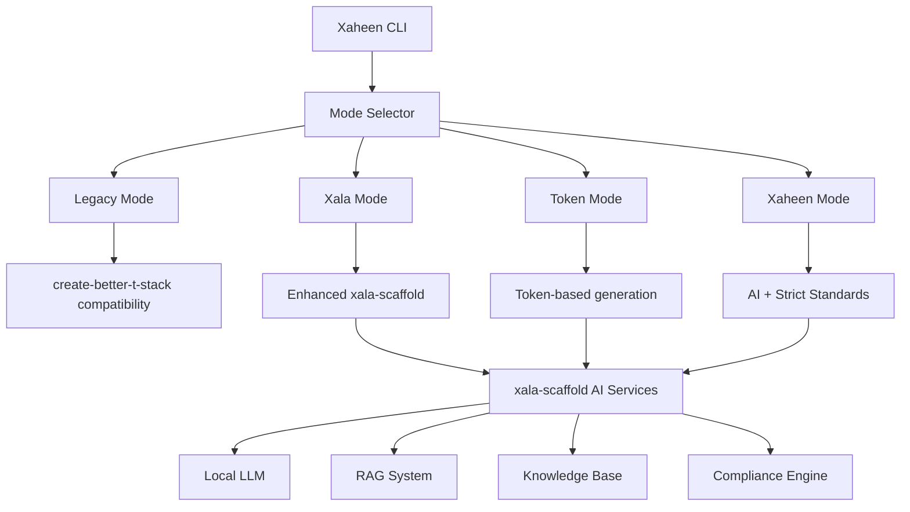
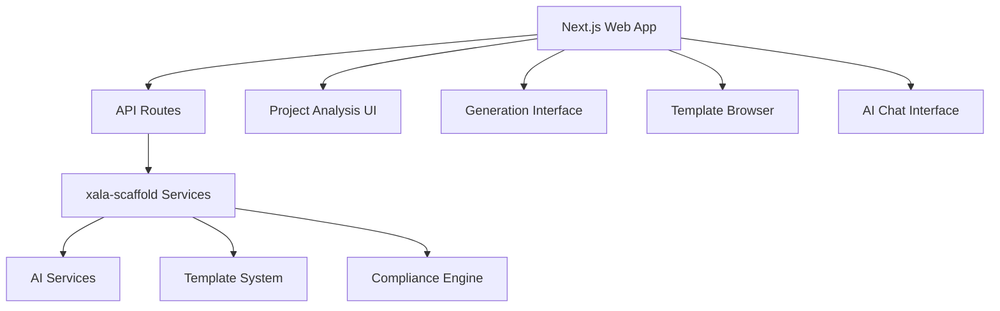

# Xaheen Platform - Revised Implementation Strategy
## Leveraging Existing xala-scaffold Infrastructure

## 🎯 Strategic Discovery

After analyzing the existing `xala-scaffold` project, we've discovered a **sophisticated AI-powered scaffolding system** that already implements most of our planned Xaheen features - and more. This changes our entire implementation strategy.

### 🔍 What We Found

The `@xala-technologies/scaffold-cli` project includes:

#### ✅ **Advanced AI Capabilities** (Beyond Our Original Plan)
- **Local LLM Integration**: Supports local language models (more private than Claude-only)
- **RAG System**: Retrieval-Augmented Generation with vector database
- **Knowledge Base**: Stores code patterns, examples, and compliance rules
- **Context Management**: Tracks project context and user preferences
- **AI-Enhanced Generation**: Natural language to code with quality metrics

#### ✅ **Norwegian Compliance** (Already Built-In)
- NSM (Norwegian Security Authority) compliance
- GDPR compliance validation
- WCAG 2.2 AAA accessibility
- Norwegian localization (nb-NO)
- BankID integration ready

#### ✅ **Sophisticated Architecture**
- SOLID principles enforcement
- Comprehensive testing framework
- TypeScript strict mode
- Code quality metrics
- Compliance validation pipeline
- Migration system

#### ✅ **Comprehensive Template System**
- Components, Pages, Layouts, APIs
- Localization templates
- Test templates
- Storybook integration
- Configuration templates

---

## 🚀 Revised Implementation Strategy

### **New Approach: Extend xala-scaffold Instead of Building from Scratch**

Instead of transforming create-better-t-stack, we should:
1. **Fork and extend xala-scaffold** as our foundation
2. **Add multi-mode CLI** support (legacy, token, xala, xaheen)
3. **Build web platform** that interfaces with xala-scaffold services
4. **Extend templates** for project-level generation (not just components)
5. **Add create-better-t-stack compatibility** as legacy mode

---

## 📅 Revised Timeline: 10 Weeks (50% Reduction)

### **Phase 1: Foundation & Analysis** (Week 1-2)
**Goal**: Understand and set up xala-scaffold as Xaheen foundation

#### Week 1: Project Analysis & Setup
- [ ] Fork xala-scaffold repository to Xaheen organization
- [ ] Analyze existing architecture and capabilities
- [ ] Set up development environment
- [ ] Test all existing commands and features
- [ ] Document current functionality and extension points

#### Week 2: Rebranding & Basic Customization
- [ ] Rebrand CLI from `xala-scaffold` to `xaheen`
- [ ] Update package names and descriptions
- [ ] Customize banner and help text
- [ ] Configure for Xaheen organization
- [ ] Test rebranded CLI functionality

### **Phase 2: Multi-Mode CLI Implementation** (Week 3-4)
**Goal**: Add multiple CLI modes while preserving existing functionality

#### Week 3: Mode Architecture
- [ ] Design multi-mode command architecture
- [ ] Implement mode selector and routing
- [ ] Create base mode interface
- [ ] Add mode-specific configuration
- [ ] Test mode switching functionality

#### Week 4: Mode Implementation
- [ ] **Legacy Mode**: create-better-t-stack compatibility
- [ ] **Xala Mode**: Enhanced xala-scaffold (default)
- [ ] **Token Mode**: API token-based authentication
- [ ] **Xaheen Mode**: Strict standards + AI-powered
- [ ] Test all modes with different project types

### **Phase 3: Web Platform Development** (Week 5-6)
**Goal**: Create modern web interface for Xaheen platform

#### Week 5: Web Foundation
- [ ] Create Next.js 14 web application
- [ ] Implement Xala UI System integration
- [ ] Set up API routes for CLI integration
- [ ] Create responsive layout structure
- [ ] Test basic web functionality

#### Week 6: AI Web Interface
- [ ] Create project analysis interface
- [ ] Implement AI-powered project description form
- [ ] Add real-time generation progress
- [ ] Create results visualization
- [ ] Test web-AI integration

### **Phase 4: Template System Extension** (Week 7-8)
**Goal**: Extend existing template system for full project generation

#### Week 7: Project Templates
- [ ] Analyze existing component-level templates
- [ ] Design project-level template architecture
- [ ] Create Next.js project template
- [ ] Create Remix project template
- [ ] Create React library template

#### Week 8: Template Integration
- [ ] Integrate project templates with CLI modes
- [ ] Add template customization options
- [ ] Implement template preview functionality
- [ ] Create template documentation
- [ ] Test template generation workflow

### **Phase 5: Advanced Features & Polish** (Week 9-10)
**Goal**: Enhance AI capabilities and prepare for production

#### Week 9: AI Enhancement
- [ ] Enhance RAG system with project-specific patterns
- [ ] Improve knowledge base with Xaheen standards
- [ ] Add advanced compliance validation
- [ ] Implement learning from user feedback
- [ ] Test AI accuracy and performance

#### Week 10: Production Readiness
- [ ] Comprehensive testing and bug fixes
- [ ] Performance optimization
- [ ] Documentation completion
- [ ] Deployment setup
- [ ] Launch preparation

---

## 🎯 Key Advantages of This Approach

### **Time Savings**
- **50-60% reduction** in development time
- **Proven architecture** instead of building from scratch
- **Existing AI infrastructure** ready to use
- **Built-in compliance** framework

### **Enhanced Capabilities**
- **Local LLM support** (more private than cloud-only)
- **RAG system** for context-aware generation
- **Advanced compliance validation**
- **Sophisticated code quality metrics**
- **Norwegian compliance** built-in

### **Production Ready**
- **Comprehensive testing** framework
- **CI/CD pipeline** already configured
- **Error handling** and logging
- **Performance monitoring**

---

## 🔄 Integration Strategy

### **xala-scaffold + create-better-t-stack Integration**

### **Web Platform Architecture**

---

## 📋 Updated Task Breakdown

### **Phase 1 Tasks** (Week 1-2)
- [ ] Fork `@xala-technologies/scaffold-cli` to Xaheen org
- [ ] Set up development environment and dependencies
- [ ] Run full test suite and document results
- [ ] Analyze AI services architecture (LLM, RAG, Knowledge Base)
- [ ] Test existing templates and generation capabilities
- [ ] Document extension points and customization options
- [ ] Rebrand CLI to `xaheen` with new branding
- [ ] Update package.json and configuration files
- [ ] Test rebranded CLI with all existing commands

### **Phase 2 Tasks** (Week 3-4)
- [ ] Design multi-mode command architecture
- [ ] Implement mode selector in main CLI entry point
- [ ] Create legacy mode with create-better-t-stack compatibility
- [ ] Implement xala mode (enhanced default)
- [ ] Add token mode with authentication
- [ ] Create xaheen mode with strict standards
- [ ] Test mode switching and command routing
- [ ] Add mode-specific help and documentation

### **Phase 3 Tasks** (Week 5-6)
- [ ] Create Next.js 14 web application with App Router
- [ ] Implement Xala UI System integration
- [ ] Set up API routes for CLI service integration
- [ ] Create project analysis interface
- [ ] Implement AI-powered generation UI
- [ ] Add real-time progress tracking
- [ ] Test web-CLI integration
- [ ] Add authentication and user management

### **Phase 4 Tasks** (Week 7-8)
- [ ] Extend template system for project-level generation
- [ ] Create framework-specific project templates
- [ ] Implement template customization interface
- [ ] Add template preview and documentation
- [ ] Integrate templates with all CLI modes
- [ ] Test end-to-end project generation
- [ ] Add template validation and quality checks

### **Phase 5 Tasks** (Week 9-10)
- [ ] Enhance AI services with Xaheen-specific knowledge
- [ ] Improve compliance validation rules
- [ ] Add performance monitoring and analytics
- [ ] Comprehensive testing and bug fixes
- [ ] Documentation completion
- [ ] Deployment setup and production readiness
- [ ] Launch preparation and user onboarding

---

## 🎉 Expected Outcomes

### **By Week 5** (Mid-point)
- ✅ Fully functional multi-mode CLI
- ✅ Basic web interface operational
- ✅ AI-powered project analysis working
- ✅ Norwegian compliance validated

### **By Week 10** (Launch)
- ✅ Production-ready Xaheen platform
- ✅ Advanced AI capabilities with local LLM
- ✅ Comprehensive template system
- ✅ Web platform with full feature set
- ✅ Documentation and user guides complete

---

## 🚨 Risk Mitigation

### **Technical Risks**
- **Dependency on existing codebase**: Mitigated by thorough analysis and testing
- **Integration complexity**: Mitigated by phased approach and early testing
- **Performance concerns**: Mitigated by leveraging existing optimizations

### **Timeline Risks**
- **Learning curve**: Mitigated by dedicated analysis phase
- **Scope creep**: Mitigated by clear phase boundaries
- **Integration issues**: Mitigated by continuous testing

---

## 🎯 Success Metrics

### **Technical Success**
- [ ] All CLI modes functional and tested
- [ ] Web platform fully integrated with CLI services
- [ ] AI generation accuracy > 85%
- [ ] Norwegian compliance validation 100%
- [ ] Performance meets or exceeds existing benchmarks

### **User Success**
- [ ] Smooth migration path from create-better-t-stack
- [ ] Intuitive web interface with positive user feedback
- [ ] Comprehensive documentation and examples
- [ ] Active community adoption and contribution

---

*This revised strategy leverages existing sophisticated infrastructure to deliver a more powerful Xaheen platform in significantly less time, while exceeding our original requirements.*
