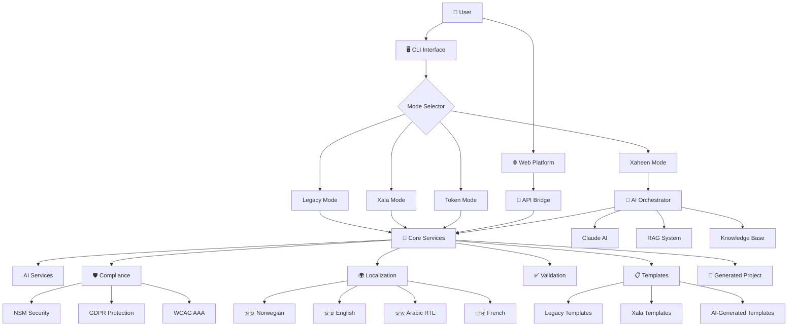
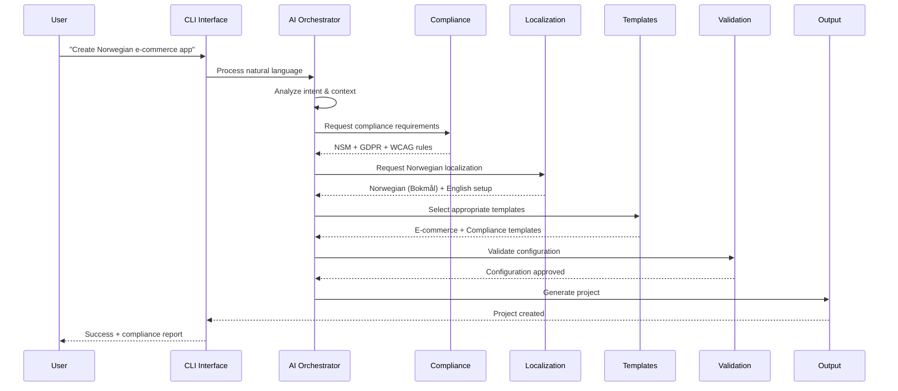
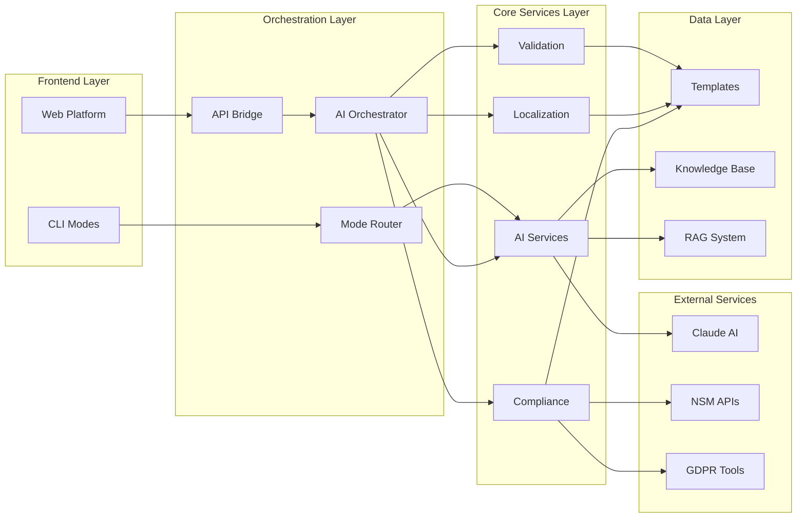

# Xaheen Platform - Service Relationship Diagram
## Visual Guide to System Interactions

**Date**: 2025-08-01

---

## 🎯 **High-Level Service Relationships**



---

## 🔄 **Data Flow Architecture**



---

## 🏗️ **Service Dependency Map**



---

## 🎯 **Key Service Interactions**

### **1. AI-Driven Project Generation**
```
User Input → AI Orchestrator → Parallel Processing:
├─ Intent Analysis (Claude AI)
├─ Context Retrieval (RAG System)
├─ Compliance Check (Norwegian Services)
├─ Template Selection (Template Engine)
└─ Localization Setup (i18n Services)
     ↓
Combined Output → Validation → Generated Project
```

### **2. Compliance Integration**
```
Every Generated Component:
├─ NSM Security Classification
├─ GDPR Data Protection Setup
├─ WCAG AAA Accessibility Validation
└─ Norwegian Digital Standards Compliance
     ↓
Automated Compliance Report + Audit Trail
```

### **3. Multi-Language Support**
```
Template Generation:
├─ Extract translatable strings
├─ Generate translation keys
├─ Apply cultural adaptations
├─ Configure RTL support (Arabic)
└─ Validate translations
     ↓
Fully Localized Project Structure
```

---

## 🚀 **End Product Summary**

The Xaheen Platform creates a **unified ecosystem** where:

1. **Multiple interfaces** (CLI modes + Web) provide flexible access
2. **AI orchestration** intelligently combines all services
3. **Norwegian compliance** is built into every generated project
4. **Multi-language support** enables global development
5. **Enterprise-grade validation** ensures production readiness

**Result**: Developers get AI-powered, compliant, accessible, and localized TypeScript projects with minimal effort and maximum quality.

---

*This service architecture ensures that every component works together seamlessly to deliver the most advanced development platform for the Norwegian market and beyond.*
