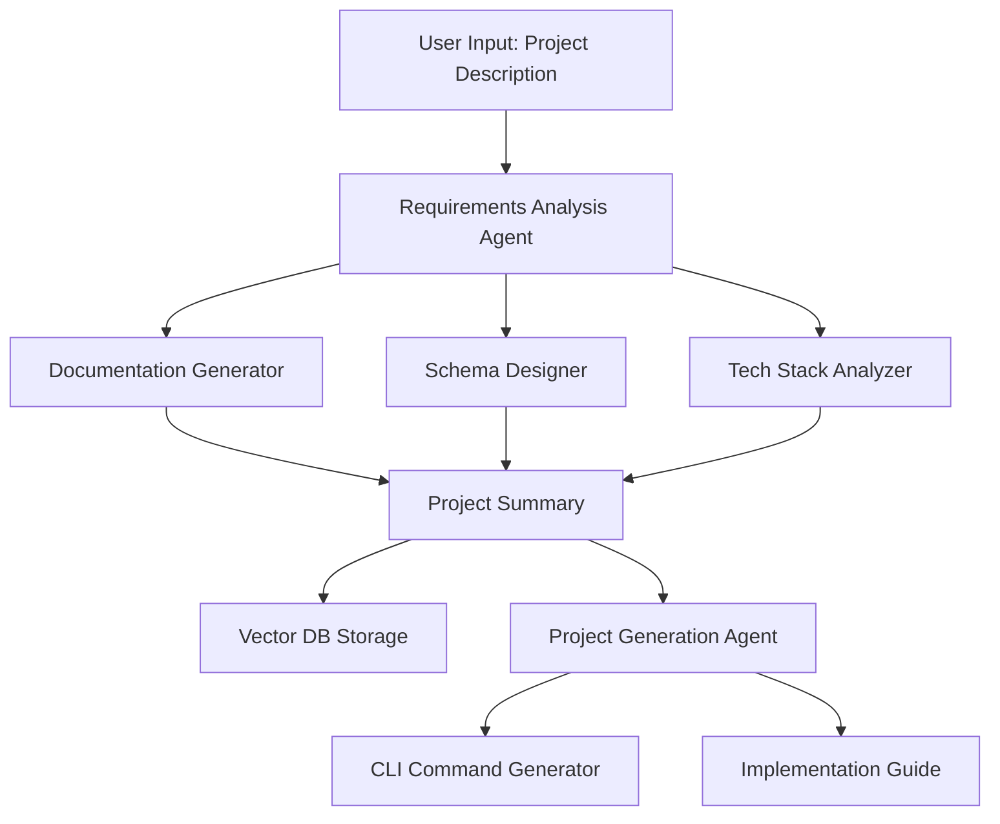

## Xaheen Web Platform Agent Integration Guide

### 🏗️ Architecture Overview



### 📁 Project Structure Extension

```
xaheen/
├── apps/
│   ├── web/
│   │   ├── src/
│   │   │   ├── app/
│   │   │   │   ├── analyze/          # NEW: Project analysis UI
│   │   │   │   ├── generate/         # NEW: Generation UI
│   │   │   │   └── api/
│   │   │   │       ├── agents/       # NEW: Agent endpoints
│   │   │   │       └── projects/     # NEW: Project storage
│   │   │   ├── agents/               # NEW: Agent implementations
│   │   │   │   ├── requirements/
│   │   │   │   ├── generator/
│   │   │   │   └── base/
│   │   │   └── lib/
│   │   │       ├── vector-db/        # NEW: Vector storage
│   │   │       └── claude/           # NEW: Claude integration
│   └── backend/                      # NEW: Dedicated backend
│       ├── src/
│       │   ├── agents/
│       │   ├── memory/
│       │   └── services/
```

### 🤖 Step 1: Agent Base Infrastructure

#### Create Base Agent Class (`apps/web/src/agents/base/BaseAgent.ts`)
```typescript
import { Anthropic } from '@anthropic-ai/sdk';
import { VectorStore } from '@/lib/vector-db';
import { XaheenStandards } from '@xaheen/standards';

export abstract class BaseAgent {
  protected claude: Anthropic;
  protected memory: VectorStore;
  protected standards = XaheenStandards;

  constructor(
    protected name: string,
    protected systemPrompt: string
  ) {
    this.claude = new Anthropic({ apiKey: process.env.ANTHROPIC_API_KEY });
    this.memory = new VectorStore();
  }

  abstract async analyze(input: string): Promise<AgentResponse>;
  
  protected async rememberContext(context: any): Promise<void> {
    await this.memory.store({
      agent: this.name,
      context,
      timestamp: new Date()
    });
  }
}
```

### 🔍 Step 2: Requirements Analysis Agent

#### Implementation (`apps/web/src/agents/requirements/RequirementsAgent.ts`)
```typescript
export class RequirementsAnalysisAgent extends BaseAgent {
  constructor() {
    super('requirements-analysis', REQUIREMENTS_PROMPT);
  }

  async analyze(projectDescription: string): Promise<ProjectRequirements> {
    // 1. Extract requirements using Claude
    const analysis = await this.claude.messages.create({
      model: 'claude-3-opus-20240229',
      system: this.systemPrompt,
      messages: [{
        role: 'user',
        content: `Analyze this project: ${projectDescription}`
      }]
    });

    // 2. Parse into structured format
    const requirements = this.parseRequirements(analysis);
    
    // 3. Store in memory for future context
    await this.rememberContext({
      projectDescription,
      requirements,
      patterns: this.extractPatterns(requirements)
    });

    return requirements;
  }

  private generateDocumentation(req: ParsedRequirements): Documentation {
    return {
      functionalRequirements: this.extractFunctionalReqs(req),
      nonFunctionalRequirements: this.extractNonFunctionalReqs(req),
      userStories: this.generateUserStories(req),
      acceptanceCriteria: this.generateAcceptanceCriteria(req)
    };
  }

  private designSchema(req: ParsedRequirements): DatabaseSchema {
    // Generate Drizzle/Prisma schema based on requirements
    return {
      entities: this.extractEntities(req),
      relationships: this.identifyRelationships(req),
      migrations: this.generateMigrations(req)
    };
  }
}
```

#### System Prompt (`apps/web/src/agents/requirements/prompts.ts`)
```typescript
export const REQUIREMENTS_PROMPT = `You are a Requirements Analysis Agent for the Xaheen platform.

Your expertise:
- Converting vague project descriptions into detailed technical specifications
- Designing database schemas following best practices
- Recommending tech stacks based on Xaheen and Xala UI System
- Ensuring all recommendations follow Xaheen development standards

Key principles:
1. ALWAYS use @xala-technologies/ui-system for UI components
2. NO raw HTML elements - only semantic components
3. Strict TypeScript with no 'any' types
4. Component-only architecture
5. Design token enforcement

When analyzing projects:
- Extract functional and non-functional requirements
- Identify entities and relationships for database
- Recommend authentication approach (BankID, Clerk, Lucia)
- Suggest appropriate Xaheen CLI template
- Consider Norwegian compliance if relevant
- Ensure WCAG 2.2 AAA accessibility`;
```

### 🎨 Step 3: Web UI Implementation

#### Analysis Page (`apps/web/src/app/analyze/page.tsx`)
```typescript
import { Stack, Card, TextArea, Button, Text } from '@xala-technologies/ui-system';
import { useState } from 'react';
import { useAgentAnalysis } from '@/hooks/useAgentAnalysis';

export default function AnalyzePage(): JSX.Element {
  const [description, setDescription] = useState('');
  const { analyze, isAnalyzing, results } = useAgentAnalysis();

  return (
    <Stack spacing="8">
      <Card variant="elevated" size="xl">
        <Stack spacing="6">
          <Text variant="heading" size="2xl">
            AI Project Analysis
          </Text>
          
          <TextArea
            label="Project Description"
            placeholder="Describe your SaaS idea..."
            rows={10}
            value={description}
            onChange={(e) => setDescription(e.target.value)}
          />
          
          <Button
            variant="primary"
            size="lg"
            onClick={() => analyze(description)}
            loading={isAnalyzing}
          >
            Analyze Project
          </Button>
        </Stack>
      </Card>

      {results && <AnalysisResults data={results} />}
    </Stack>
  );
}
```

#### Results Component (`apps/web/src/components/AnalysisResults.tsx`)
```typescript
export const AnalysisResults = ({ data }: AnalysisResultsProps): JSX.Element => {
  return (
    <Stack spacing="6">
      {/* Tech Stack Recommendations */}
      <Card variant="bordered">
        <Stack spacing="4">
          <Text variant="heading" size="lg">Tech Stack</Text>
          <Grid cols={{ base: 1, md: 2 }} spacing="4">
            <InfoCard title="Frontend" value={data.techStack.frontend} />
            <InfoCard title="Backend" value={data.techStack.backend} />
            <InfoCard title="Database" value={data.techStack.database} />
            <InfoCard title="Auth" value={data.techStack.auth} />
          </Grid>
        </Stack>
      </Card>

      {/* Database Schema */}
      <Card variant="bordered">
        <Stack spacing="4">
          <Text variant="heading" size="lg">Database Schema</Text>
          <SchemaVisualizer schema={data.schema} />
        </Stack>
      </Card>

      {/* Generated Documentation */}
      <Card variant="bordered">
        <Stack spacing="4">
          <Text variant="heading" size="lg">Requirements</Text>
          <DocumentationViewer docs={data.documentation} />
        </Stack>
      </Card>
    </Stack>
  );
};
```

### 💾 Step 4: Vector Database Integration

#### Vector Store Setup (`apps/web/src/lib/vector-db/index.ts`)
```typescript
import { Pinecone } from '@pinecone-database/pinecone';
import { OpenAIEmbeddings } from 'langchain/embeddings/openai';

export class VectorStore {
  private pinecone: Pinecone;
  private embeddings: OpenAIEmbeddings;

  constructor() {
    this.pinecone = new Pinecone({
      apiKey: process.env.PINECONE_API_KEY!,
      environment: process.env.PINECONE_ENV!
    });
    
    this.embeddings = new OpenAIEmbeddings();
  }

  async store(data: ProjectContext): Promise<void> {
    const index = this.pinecone.Index('xaheen-projects');
    
    // Convert to embeddings
    const vectors = await this.embeddings.embedDocuments([
      data.projectDescription,
      JSON.stringify(data.requirements),
      JSON.stringify(data.techStack)
    ]);

    // Store with metadata
    await index.upsert({
      vectors: vectors.map((v, i) => ({
        id: `${data.projectId}-${i}`,
        values: v,
        metadata: {
          projectId: data.projectId,
          type: ['description', 'requirements', 'techStack'][i],
          timestamp: new Date().toISOString()
        }
      }))
    });
  }

  async retrieveSimilar(query: string, k = 5): Promise<ProjectContext[]> {
    // Retrieve similar projects for context
    const queryVector = await this.embeddings.embedQuery(query);
    const results = await this.pinecone.Index('xaheen-projects').query({
      vector: queryVector,
      topK: k,
      includeMetadata: true
    });

    return this.hydrateResults(results);
  }
}
```

### 🛠️ Step 5: Project Generation Agent

#### Generator Agent (`apps/web/src/agents/generator/GeneratorAgent.ts`)
```typescript
export class ProjectGeneratorAgent extends BaseAgent {
  constructor() {
    super('project-generator', GENERATOR_PROMPT);
  }

  async generateCommands(requirements: ProjectRequirements): Promise<GenerationPlan> {
    // 1. Retrieve similar projects for context
    const context = await this.memory.retrieveSimilar(
      JSON.stringify(requirements)
    );

    // 2. Generate CLI commands
    const commands = await this.generateCLICommands(requirements, context);
    
    // 3. Create implementation guide
    const guide = await this.createImplementationGuide(requirements, commands);

    return {
      commands,
      guide,
      files: this.generateFileStructure(requirements),
      timeline: this.estimateTimeline(requirements)
    };
  }

  private async generateCLICommands(
    req: ProjectRequirements,
    context: ProjectContext[]
  ): Promise<CLICommand[]> {
    const response = await this.claude.messages.create({
      model: 'claude-3-opus-20240229',
      system: this.systemPrompt,
      messages: [{
        role: 'user',
        content: `Generate Xaheen CLI commands for: ${JSON.stringify(req)}`
      }]
    });

    return this.parseCLICommands(response);
  }

  private parseCLICommands(response: any): CLICommand[] {
    // Parse Claude response into structured commands
    return [
      {
        command: 'xaheen xala my-app --template enterprise-saas',
        description: 'Initialize project with Xala UI System',
        order: 1
      },
      {
        command: 'cd my-app && xaheen xaheen:validate',
        description: 'Validate initial setup',
        order: 2
      },
      // ... more commands
    ];
  }
}
```

### 🖥️ Step 6: Generation UI

#### Generation Page (`apps/web/src/app/generate/[projectId]/page.tsx`)
```typescript
export default function GeneratePage({ params }: Props): JSX.Element {
  const { projectId } = params;
  const { project, commands, guide } = useProjectGeneration(projectId);

  return (
    <Stack spacing="8">
      {/* Command Terminal */}
      <Card variant="elevated">
        <Stack spacing="4">
          <Text variant="heading" size="xl">CLI Commands</Text>
          <CommandTerminal commands={commands} />
        </Stack>
      </Card>

      {/* Step-by-Step Guide */}
      <Card variant="elevated">
        <Stack spacing="4">
          <Text variant="heading" size="xl">Implementation Guide</Text>
          <ImplementationGuide guide={guide} />
        </Stack>
      </Card>

      {/* File Structure Preview */}
      <Card variant="elevated">
        <Stack spacing="4">
          <Text variant="heading" size="xl">Project Structure</Text>
          <FileTreeViewer structure={project.fileStructure} />
        </Stack>
      </Card>
    </Stack>
  );
}
```

#### Command Terminal Component
```typescript
export const CommandTerminal = ({ commands }: Props): JSX.Element => {
  const [executed, setExecuted] = useState<number[]>([]);

  const executeCommand = async (cmd: CLICommand) => {
    // Copy to clipboard
    await navigator.clipboard.writeText(cmd.command);
    setExecuted([...executed, cmd.order]);
  };

  return (
    <Stack spacing="3">
      {commands.map((cmd) => (
        <CommandItem
          key={cmd.order}
          command={cmd}
          isExecuted={executed.includes(cmd.order)}
          onExecute={executeCommand}
        />
      ))}
    </Stack>
  );
};
```

### 🔄 Step 7: API Routes

#### Analysis Endpoint (`apps/web/src/app/api/agents/analyze/route.ts`)
```typescript
export async function POST(req: Request) {
  const { description, documents } = await req.json();
  
  // Initialize agent
  const agent = new RequirementsAnalysisAgent();
  
  // Analyze project
  const analysis = await agent.analyze(description, documents);
  
  // Store in database
  const projectId = await storeProject(analysis);
  
  return NextResponse.json({
    projectId,
    analysis,
    summary: generateSummary(analysis)
  });
}
```

### 📊 Step 8: Real-time Updates

#### Socket.IO Integration (`apps/backend/src/sockets/agent-updates.ts`)
```typescript
export function setupAgentSockets(io: Server) {
  io.on('connection', (socket) => {
    socket.on('analyze:start', async (data) => {
      const agent = new RequirementsAnalysisAgent();
      
      // Stream progress updates
      agent.on('progress', (progress) => {
        socket.emit('analyze:progress', progress);
      });
      
      const result = await agent.analyze(data);
      socket.emit('analyze:complete', result);
    });
  });
}
```

### 🧠 Step 9: Memory & Learning

#### Context Manager (`apps/backend/src/memory/ContextManager.ts`)
```typescript
export class ContextManager {
  async saveProjectContext(project: ProjectAnalysis): Promise<void> {
    // 1. Extract patterns
    const patterns = this.extractPatterns(project);
    
    // 2. Store in vector DB
    await this.vectorStore.store({
      ...project,
      patterns,
      embeddings: await this.generateEmbeddings(project)
    });
    
    // 3. Update agent knowledge base
    await this.updateAgentKnowledge(patterns);
  }

  private extractPatterns(project: ProjectAnalysis): Pattern[] {
    return [
      {
        type: 'tech-stack',
        pattern: project.techStack,
        frequency: this.calculateFrequency(project.techStack)
      },
      {
        type: 'auth-method',
        pattern: project.auth,
        context: project.requirements
      }
    ];
  }
}
```

### 🚀 Step 10: Deployment Considerations

#### Environment Variables
```env
# AI Services
ANTHROPIC_API_KEY=sk-ant-...
OPENAI_API_KEY=sk-...

# Vector Database
PINECONE_API_KEY=...
PINECONE_ENV=...

# Database
DATABASE_URL=postgresql://...
REDIS_URL=redis://...

# Agent Configuration
AGENT_MAX_TOKENS=100000
AGENT_TEMPERATURE=0.7
AGENT_CONTEXT_WINDOW=200000
```

### 📝 Usage Flow

1. **User submits project description** → Analysis page
2. **Requirements Agent analyzes** → Generates docs, schema, tech stack
3. **Results saved to vector DB** → Context for future projects
4. **User reviews and approves** → Proceeds to generation
5. **Generator Agent creates** → CLI commands & guide
6. **User executes commands** → Project scaffolded
7. **Implementation guide** → Step-by-step development

This creates a powerful AI-driven project generation system that maintains Xaheen's strict standards while leveraging the collective knowledge from previous projects.